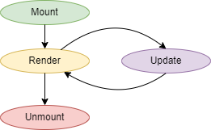

# Todo React App

Below we will give a brief introduction to React by rewriting the todo app
example in React. Note for simplicity we are using local storage to store
todo items (this app is equivalent to the 
[todo app example from lecture 2](https://github.com/choyiny/cscc09.com/tree/main/lectures/02-javascript/todo)).


Firstly, React is frontend framework for JavaScript (although some people
argue that it's a library instead). React allows us to easily split 
code into units of abstraction called components. The real power behind
components is that they can be composed of smaller components to create
larger and more complex systems. React also brings to the table a powerful
feature called reactivity (hence the name React). Reactivity allows for UI
elements to reactively update to data state changes without the developer
manually having to do the update. This by far is one of the most powerful
features that most if not all modern JavaScript frameworks bring to the table
and allows for us the developer to greatly reduce the potentially
complicated and bug-prone boilerplate code needed for updating UI elements
with new data.

React components are simply defined as a function that returns some code that
will be rendered.

```jsx
function MyReactComponent() {
  return (
    <div>Hello World!</div>
  );
}
```

Now you might have just noticed here that we wrote some HTML in JavaScript
without setting `innerHTML` to an HTML string. This a feature included in
React called JSX which is a syntax extension to JavaScript. This essentially
is some syntactic sugar that allows us to write HTML and React elements
in JavaScript in a more natural way. Just note that we actually are not writing
HTML here but rather just JavaScript and that React will take this code that we
have written and use it to render elements in the DOM. For those who are
interested, JSX code will be translated into JavaScript underneath the hood
where calls to `React.createElement` are used to create all the elements
(you can read more about it
[here](https://reactjs.org/docs/react-without-jsx.html), but it's not required
for this lab). 

Also, another thing to note is that hooks are a relatively new addition to
React (they came out in 2019 in React 16.8). Before hooks, components were
defined with JavaScript classes instead. Functional components like what we
just showed you still existed before then, however, a major caveat was that
they were only able to be stateless. Since the release of hooks, they have
become the preferred method to write components in the React community,
which is why this tutorial will only be using them. However, it is still
important to know that class based components exist because plenty of examples
and documentation (including parts of the official React documentation) still
use them. Everything a class component can do can also be done with functional
components and hooks (barring a few very very very edge cases).

## The Component Lifecycle

Each React component has a lifecycle that it follows. When the component
is initially added in, it will be mounted. After mounting is completed
the initial render occurs. Updates occur whenever something that the component
depends on reactively changes (for example, a component's props or state
changes). An update will trigger the component to be rerender. This update
process will also be propagated down to any sub components that the current
component renders. Finally, when the component is ready to be removed (either
by the app being closed or a component being conditionally rendered out),
the component will be unmounted along will all its children components.



## TODO App Component Structure

Before we begin writing any code, it is a good idea to have an understanding
of how we want to split our app's logic up into different components. By
convention, we often define our root component as `App`. This component acts
as the base of our app and will manage the state of our application and 
render the sub-components of the app.

The todo app itself has two main features: creating a new todo item
and displaying the existing todo items. As such it logically makes sense that
these two parts should be defined into two separate components. Let's call these
two components `AddItemForm` and `Items`. `Items` will be responsible for
displaying *all* our current todo items. However, it also makes sense that each
item itself should be represented as a component. We will call this component
`Item`. As such, `Items` itself will render one `Item` per each item in our
todo list. On the other hand `AddItemForm` will manage the input for creating
a new todo item.

Visually our component tree will look as follows:

```
App
|-- AddItemForm
|-- Items
    | -- Item
    | -- Item
    [...]
    | -- Item
```

## The App

So let's start by defining our root component `App`:

```jsx
// src/App.js
import "./App.css";

function App() {
  return (
    <div className="App">
      Hello There
    </div>
  );
}

export default App;
```

Note: recall that anything we write here is in JavaScript which means that
`class` is a reserved keyword. As such, to define a class on an element we
use `className` instead when using React.

Currently, `App` simply displays the text "Hello There". However, we want it to
allow us to add new items and display the current items. 

Our first instinct would be to define a variable that keeps track of items
within the `App` component like so:

```jsx
// src/App.js
import "./App.css";

function App() {
  let items = [];

  return (
    <div className="App">
      Hello There
    </div>
  );
}

export default App;
```

However, this will not work because every time `App` rerenders, `items` will be
reset to the empty array. To achieve what we want to do here we need to
introduce the concept of hooks. Hooks are a way to "attach" additional behavior
to a component. There are a multitude of default hooks provided in React but
the ones you will use most often likely will be `useState`, `useEffect`,
`useRef` and `useMemo`. The real power behind hooks is that you can build your
own hooks out of the basic hooks which provides a powerful level of abstraction.
When naming hooks, it is convention to prefix them with "use". Now, back to
our issue here. We want to retain the value of `items` every time `App`
rerenders. This can be achieved with the `useState` hook, as follows:


```jsx
// src/App.js
import "./App.css";

function App() {
  const [items, setItems] = useState([]);

  return (
    <div className="App">
      Hello There
    </div>
  );
}

export default App;
```

The `useState` hook takes in an initial value as a parameter and returns a
2-element array (i.e. a tuple) where the first element is the value of the
state and the second element is a function that we can call to update the
state. Note, you MUST set the value using the function. The reason we can't set
the value manually (e.x. `items = [...items, {id: "foo", content: "bar"}])`
or `items.push({id: "foo", content: "bar"})` is because React will not see
that `items` is changed and update any components that rely on it reactively.

Another thing to note is that we also imported a CSS file at the top of `App`.
This will include the stylesheet for the App component into our site. 
We won't go over it too much here but in general, we keep styles that pertain
to the given component in this file. However, the biggest thing to note with
this is that our CSS is not actually scoped to *only* the component but rather
is imported **globally**, so you must be careful with having common selectors
because they can inadvertently affect styles of other components if not designed
properly. A common naming scheme to ensure no CSS conflicts occur is to use the
[BEM (Block Element Modifier)](http://getbem.com/) naming convention.

We now will define some simple functions that allow us to easily create and
delete items:

```jsx
// src/App.js
import { useState } from "react";

function App() {
  const [items, setItems] = useState([]);

  const createItem = (content) => {
    const newItem = {
      id: `item-${items.length}`,
      content, // Tip: shortcut for writing "content: content"
    };
    // The "..." is called the "spread operator"
    setItems(() => [...items, newItem]);
  };

  const deleteItem = (itemIdx) => {
    setItems(() => {
      // This little trick makes a new shallow copy of the items array
      const newItems = [...items];
      newItems.splice(itemIdx, 1);
      return newItems;
    });
  };

  return (
    <div className="App">
      Hello There
    </div>
  );
}

export default App;
```

### AddItemForm

Now that we have our `App` component roughed in, we want to start to design
the sub-components. Firstly, lets implement the `AddItemForm` component.
This component handles the form that allows us to create new todo items.
Let's start by rouging in the basic boilerplate for the component:

```jsx
// src/components/AddItemForm.js
import "./AddItemForm.css";

export function AddItemForm() {
  return (<div>TODO: make the form</div>);
}
```

We then can use this newly created component within `App` itself:

```jsx
// src/App.js
import { useState } from "react";
// Note: when importing .js files we do not need to include the extension
import { AddItemForm } from "./components/AddItemForm";

function App() {
  const [items, setItems] = useState([]);

  // ...

  return (
    <div className="App">
      <AddItemForm />
    </div>
  );
}

export default App;
```

In `App` we have the `createItem` that allows us to easily create new items
in our `items` state. It would be useful if our `AddItemForm` component had
access to this function somehow. This is where props come in. Props allow us to
pass in references to values from our parent component to children components.
Props are accessed in the first parameter of the component function.

```jsx
// src/components/AddItemForm.js
import "./AddItemForm.css";

export function AddItemForm(props) {
  const { createItem } = props; // Tip: this syntax is called "object destructuring"

  return (<div>TODO: make the form</div>);
}
```

We then can update `App` to pass a reference to `createItem` to `AddItemForm`

```jsx
// src/App.js
import { useState } from "react";
import { AddItemForm } from "./components/AddItemForm";

function App() {
  const [items, setItems] = useState([]);

  // ...

  return (
    <div className="App">
      <AddItemForm createItem={createItem} />
    </div>
  );
}

export default App;
```

Now we will port in a modified version of the HTML code in the original app.

```jsx
// src/components/AddItemForm.js
import "./AddItemForm.css";

export function AddItemForm(props) {
  const { createItem } = props;

  const handleSubmit = (e) => {
    e.preventDefault();

    // How do we get the current value of our input element?
  };

  return (
    <form className="AddItemForm" onSubmit={handleSubmit}>
      <input
        type="text"
        className="AddItemForm__item-content AddItemForm__element"
        placeholder="Enter your ToDo item"
        name="item"
        required
      />
    </form>
  );
}
```

So we have our handler setup to call whenever we submit the form (i.e.
when we press enter). However, the issue now is how do we get the value that
our `input` element is currently at? Our first thought would be to simply
use `document.querySelector` to find the input element and then read it's
value. However, this is not the recommend approach in React. The biggest
issue being that nothing is stopping us from making two instances of
`AddItemForm`, which in that case how to we know which one is the one
for the current call to `handleSubmit`? To counteract this issue, React has
"references", or "refs" for short. As the name implies this allows us to 
keep a reference to something. The most common use-case for this is to keep
a reference to a DOM object.

With hooks, you can use the `useRef` to create a reference and then assign
it to an HTML element by using the `ref` attribute. Implementing this into
`AddItemForm` gives us the following:

```jsx
// src/components/AddItemForm.js
import "./AddItemForm.css";

export function AddItemForm(props) {
  const { createItem } = props;

  // By default our reference value will be `null` but will be set to
  // the input element once it is mounted
  const itemContentRef = useRef(null);

  const handleSubmit = (e) => {
    e.preventDefault();

    // We can access the reference value by using itemContentRef.current
    const content = itemContentRef.current.value;
    createItem(content);

    // We also might as well clear the form after we submit
    e.target.reset();
  };

  return (
    <form className="AddItemForm" onSubmit={handleSubmit}>
      <input
        type="text"
        className="AddItemForm__item-content AddItemForm__element"
        placeholder="Enter your ToDo item"
        name="item"
        required
        // This tells React that we want `itemContentRef` to reference
        // the input element
        ref={itemContentRef}
      />
    </form>
  );
}
```

You should now be able to create new items. Now let's move onto actually 
displaying our items.

### Items

Our `Items` component will be responsible for displaying all our todo items.
Our props will be `items` which is the list of all items and `deleteItem` which
is a reference to the `deleteItem` function. For each todo item in `items` we
will render an instance of the `Item` component which is responsible for
displaying its given item as well as telling us when the delete button for that
item is clicked.

```jsx
// components/Items.js
import "./Items.css";

export function Items(props) {
  const { items, deleteItem } = props;

  return (
    <div className="Items"></div>
  );
}
```

In `App` we use `Items` as such:

```jsx
// src/App.js
import { useState } from "react";
import { AddItemForm } from "./components/AddItemForm";
import { Items } from "./components/Items";

function App() {
  const [items, setItems] = useState([]);

  // ...

  return (
    <div className="App">
      <AddItemForm createItem={createItem} />
      <Items items={items} deleteItem={deleteItem} />
    </div>
  );
}

export default App;
```

Ignoring, `deleteItems` and the `Item` component for now, let's just quickly
render our items as simple `div` elements. To do this in React, we must use
the `map` function. We want to essentially map our items to a list of 
HTML/React components. React will see this list and automatically render all
of them in the DOM. One important thing to note is that when rendering lists
we must provide a unique `key` attribute for each item. This helps React keep
track of which item is which.

```jsx
// components/Items.js
import "./Items.css";

export function Items(props) {
  const { items, deleteItem } = props;

  return (
    <div className="Items">
      {items.map((item, idx) => (
        <div key={`item-idx-${idx}`}>{item}</div>
      ))}
    </div>
  );
}
```

We also would like to add some text that tells us when no todo items exist.
This is called conditionally rendering and is done using the ternary operator.

```jsx
// components/Items.js
import "./Items.css";

export function Items(props) {
  const { items, deleteItem } = props;

  return (
    <div className="Items">
      {items.length === 0 ? (
        <h2>No items added yet, try adding some.</h2>
      ) : (
        items.map((item, idx) => (
          <div key={`item-idx-${idx}`}>{item}</div>
        ))
      )}
    </div>
  );
}
```

Now, let's design the `Item` component. For props, we want to receive the
todo item that it needs to display as well as a function that it can call
to delete this todo item. The component for this will look like the following:

```jsx
// components/Item.js
import "./Item.css";

export function Item(props) {
  const { item, deleteThisItem } = props;

  return (
    <div className="Item">
      <div className="Item__content">{item.content}</div>
      <div className="Item__delete-icon" onClick={deleteThisItem}></div>
    </div>
  );
}
```

Now let's replace our simple div element that display our todo items with
the `Item` component:

```jsx
// components/Items.js
import "./Items.css";
import { Item } from "./Item";

export function Items(props) {
  const { items, deleteItem } = props;

  return (
    <div className="Items">
      {items.length === 0 ? (
        <h2>No items added yet, try adding some.</h2>
      ) : (
        items.map((item, idx) => (
          <Item
            key={`item-idx-${idx}`}
            item={item}
            deleteThisItem={() => deleteItem(idx)}
          />
        ))
      )}
    </div>
  );
}
```

One thing to note is how we handled setting up the function to pass into
`Item`'s `deleteThisItem` prop. Since `deleteItem` takes the index of the
item we want to delete but `deleteThisItem` does not, we define a new function
that when called will delete the todo item that it was currently on.

## Adding Local Storage

At this point, the todo app is fully functional. However, our todo items are
only stored in memory and are not persisted to local storage. As such let us
define two helper functions to load and save todo items to local storage:

```jsx
// src/App.js
import { useState } from "react";
import { AddItemForm } from "./components/AddItemForm";
import { Items } from "./components/Items";

const ITEMS_STORAGE_KEY = "todo";

// Note: we do not need to define these functions within the `App` component
// because they are purely vanilla JavaScript and do not use any React specific 
// features
const loadItems = () => {
  const itemDataRaw = localStorage.getItem(ITEMS_STORAGE_KEY);
  const itemData = itemDataRaw ? JSON.parse(itemDataRaw) : [];
  return itemData;
};

const saveItems = (items) => {
  localStorage.setItem(ITEMS_STORAGE_KEY, JSON.stringify(items));
};

function App() {
  // Here we initially populate items by loading the todo items from local storage
  const [items, setItems] = useState(loadItems());

  const createItem = (content) => {
    const newItem = {
      id: `item-${items.length}`,
      content,
    };
    setItems(() => [...items, newItem]);
  };

  const deleteItem = (itemIdx) => {
    setItems(() => {
      const newItems = [...items];
      newItems.splice(itemIdx, 1);
      return newItems;
    });
  };

  return (
    <div className="App">
      <AddItemForm createItem={createItem} />
      <Items items={items} deleteItem={deleteItem} />
    </div>
  );
}

export default App;
```

Now you may have noticed that we have not used `saveItems` anywhere yet. The
most intuitive place that you would expect to call this function would be
anywhere we change `items` (i.e. in any call to `setItems`). This would 100%
work, however, there is a element of maintainability here where as our app
grows, we will constantly have to add new calls to `saveItems` in every single
place that updates `items`. This can easily get out of hand and cause bugs when
you inevitably forget one spot.

To avoid this maintainability headache, let's introduce the `useEffect` hook.
This hook by far is one of the most confusing to learn initially but it is by
far one of the most powerful hooks in React. In essence, this hook allows you to
perform "side effects". The "side effect" that we want to do is to save
`items` to local storage every time it changes. At the very basic level,
`useEffect` takes in two parameters, a function and an array of dependencies.
Every time one of the dependencies in the array changes, the function will
be run. As such let's look how we'd use `useEffect` in `App` to save the `items`
state to local storage:

```jsx
// src/App.js
import { useState, useEffect } from "react";
import { AddItemForm } from "./components/AddItemForm";
import { Items } from "./components/Items";

const ITEMS_STORAGE_KEY = "todo";

const loadItems = () => {
  const itemDataRaw = localStorage.getItem(ITEMS_STORAGE_KEY);
  const itemData = itemDataRaw ? JSON.parse(itemDataRaw) : [];
  return itemData;
};

const saveItems = (items) => {
  localStorage.setItem(ITEMS_STORAGE_KEY, JSON.stringify(items));
};

function App() {
  const [items, setItems] = useState(loadItems());

  // Here our dependency array only contains `items`. As such the function
  // passed in will be called every time `items` changes.
  useEffect(() => {
    saveItems(items);
  }, [items]);

  const createItem = (content) => {
    const newItem = {
      id: `item-${items.length}`,
      content, 
    };
    setItems(() => [...items, newItem]);
  };

  const deleteItem = (itemIdx) => {
    setItems(() => {
      const newItems = [...items];
      newItems.splice(itemIdx, 1);
      return newItems;
    });
  };

  return (
    <div className="App">
      <AddItemForm createItem={createItem} />
      <Items items={items} deleteItem={deleteItem} />
    </div>
  );
}

export default App;
```

There are plenty of more tricks you can do with `useEffect`. For example, if
you return a function in the passed in function, that returned function will
be called once the component is unmounted (useful for setting up and cleaning up
subscriptions). Additionally, if the dependency array is empty, the passed in
function will only be called once when the component is mounted. Furthermore,
if no dependency array is passed in, then the passed in function will be run
every time the component renders.

And thats it, we have successfully converted the todo app to use React!